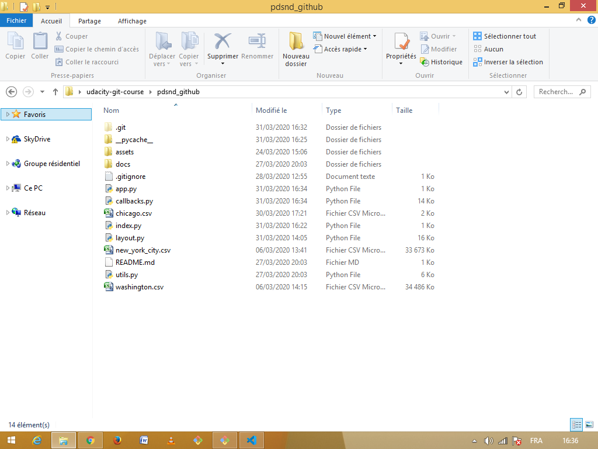

### Date created
This project was created on 2020-03-24.

### Project Title
Explore US bikeshare data

### Description
This project is a web app that displays various statistics about data related to bicycle-sharing systems for 3 cities in the United States: Chicago, New York City and Washington DC.

A bicycle-sharing system is a service in which bicycles are rented to individuals on a short term basis for a price.

The data is provided by [Motivate](https://www.motivateco.com), a bike share company that operates in many US cities.

### Files used
- [app.py](/app.py) : contains the code that generates the UI.
- [utils.py](/utils.py) : contains the code that calculates the statistics.
- [styles.css](/assets/styles.css) \(in the assets folder) : contains the styling of the UI
- The data files are not included in the repository but you can download them from [here](https://drive.google.com/open?id=1n_WqVKBf2zdx1GXjC6PXpo8GbqYK_LaS) then include them in the root folder of the project before running the app.

### Installation
Firstly, you need to install [Dash](https://plotly.com/dash/), a python framework for building web apps :

`pip install dash==1.9.1`

There may be new updates so you should check the official [installation guide](https://dash.plotly.com/installation) for the latest version.

This project uses [Pandas](https://pandas.pydata.org/docs/index.html), a library for data manipulation and analysis. You can install it with pip :

`pip install pandas`

Or with [Anaconda](https://www.anaconda.com/), a python distribution with a focus on data science. If you’re interested in Anaconda you can follow their [installation guide](https://www.anaconda.com/distribution/).

Lastly, you need to download the three data files \(chicago.csv, new_york_city.csv, washington.csv) from [here](https://drive.google.com/open?id=1n_WqVKBf2zdx1GXjC6PXpo8GbqYK_LaS) and add them to the root directory of the project with the app.py file.

When you’re finished your project should look like this : 

### Running the app
Once everything is set up, run app.py in your terminal :

`python app.py`

The output of this command will prompt you to visit http://127.0.0.1:8050/ , open the link in your web browser to start interacting with the app.

### Credits
Thanks to [Udacity](https://www.udacity.com/) for their great teaching.

Thanks to [Dash](https://plotly.com/) for their amazing user guide.

